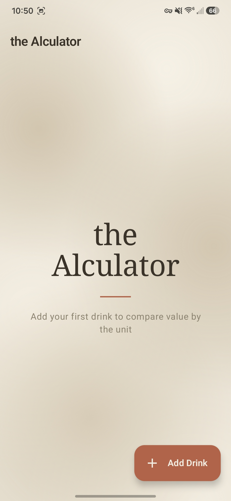
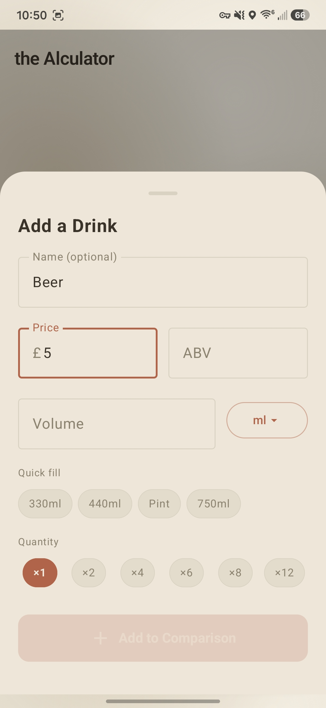
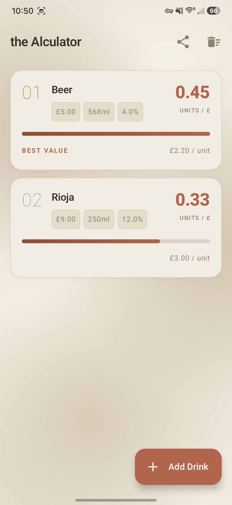

<h1 align="center">the Alculator</h1>

<p align="center">
  Find the <b>best value alcohol</b> — ranks drinks by alcohol units per £, instantly.<br/>
  Enter a price, ABV and volume. It does the maths.
</p>

<p align="center">
  
  
  
  <a href="https://github.com/IvoryCobra-VC/the-alculator/releases/latest"></a>
</p>

---

## Screenshots

<p align="center">
  
  
  
</p>

## What it does

Enter any drink's price, ABV% and volume. the Alculator ranks everything by **alcohol units per £** — the higher the score, the better the value. Add as many drinks as you like and compare at a glance.

Units are calculated the standard UK way: `ABV% × volume (ml) ÷ 1000`. Value = `units ÷ price`.

## Features

- **Ranks by units per £** — best value rises to the top with an animated value bar
- **Cost-per-unit and total units** shown on every card
- **Multipack support** — pick a can size (330/440ml, pint, 750ml) then ×1, ×2, ×4, ×6, ×8 or ×12
- **Volume units** — switch between ml, cl, litres and pints
- **Tap to edit** any drink; **swipe to delete**
- **Share rankings** as text
- **Limewash design** — soft chalk aesthetic, no clutter, one screen

## Install

1. Download `the-alculator-v1.0.apk` from the [latest release](https://github.com/IvoryCobra-VC/the-alculator/releases/latest)
2. Enable **Install from unknown sources** on your device (Settings → Apps → Special app access)
3. Open the downloaded APK and install

A `SHA256` checksum file is published alongside each APK for verification.

## Privacy

the Alculator collects nothing. No accounts, no network connections, no ads, no tracking.
Everything you enter lives only in the app's memory and is gone when you close it.

Full policy: [ivorycobra-vc.github.io/alculator-privacy](https://ivorycobra-vc.github.io/alculator-privacy/)

## Build from source

```bash
git clone https://github.com/IvoryCobra-VC/the-alculator
cd the-alculator
./gradlew assembleDebug
```

Requires Android SDK (API 35) and JDK 17. The debug APK lands at
`app/build/outputs/apk/debug/Alculator-debug.apk`.

For a signed release build, add `KEYSTORE_FILE`, `KEYSTORE_PASSWORD`, `KEY_ALIAS` and `KEY_PASSWORD`
to `local.properties`, then run `./gradlew assembleRelease`.

## Tech

- Kotlin + Jetpack Compose (Material3)
- `StateFlow` ViewModel — in-memory only, no persistence
- `SwipeToDismissBox`, `ModalBottomSheet`, `lightColorScheme`
- AGP 8.7.3 · Gradle 8.9 · compileSdk/targetSdk 35 · minSdk 26

## License

[MIT](LICENSE)
